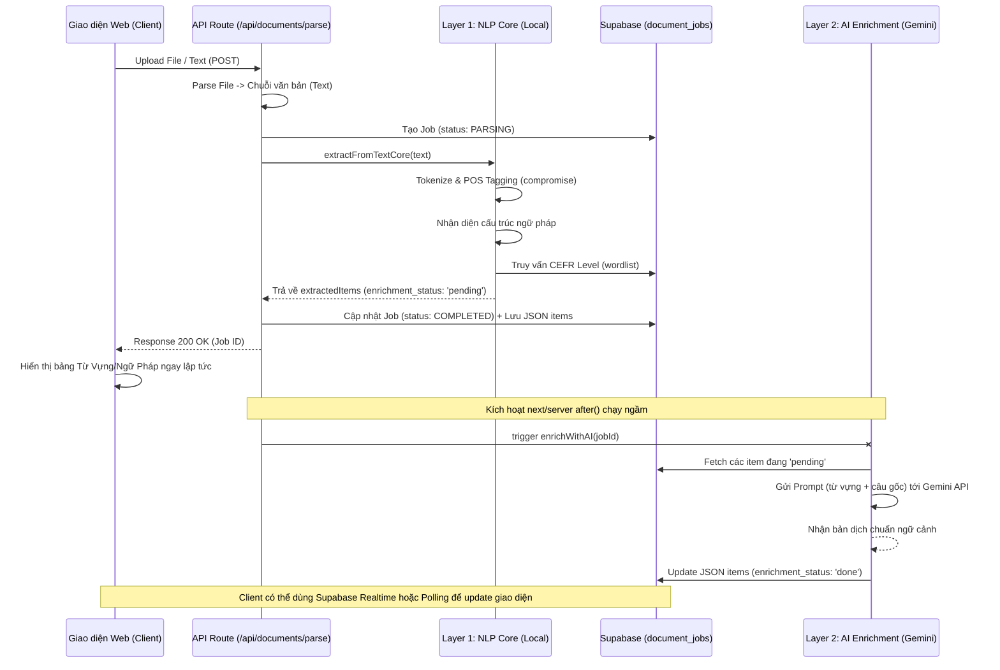

# Kiến trúc Chức năng Scan & Extract (Hybrid Architecture)

**Scan & Extract** là tính năng cốt lõi của Orbit Translate, cho phép người dùng tải lên tài liệu (PDF, DOCX, TXT) hoặc dán văn bản thô để hệ thống tự động bóc tách từ vựng theo chuẩn CEFR, nhận diện các mẫu ngữ pháp phổ biến, và dịch theo đúng ngữ cảnh.

Để giải quyết vấn đề timeout của serverless (Vercel giới hạn 10 giây ở Hobby Plan) và hạn chế về tốc độ của LLM, tính năng này được thiết kế theo mô hình **Hybrid: Non-AI Core + AI Enrichment Layer**.

---

## 1. Sơ đồ Hoạt động (Activity Diagram)

---

## 2. Kiến trúc 2 Lớp (Two-Layer Architecture)

### Layer 1: Non-AI Core (Đồng bộ, Critical Path)
- **Nhiệm vụ:** Đảm bảo hệ thống luôn trả về dữ liệu nhanh chóng (dưới 1 giây) để giao diện không bị treo. Hoạt động độc lập không phụ thuộc vào tình trạng API Key của Gemini.
- **Công nghệ:** `compromise` (Thư viện NLP Rule-based chạy thẳng trên Node.js).
- **Quy trình:**
  1. Tách câu và từ vựng (`sentences`, `words`).
  2. Áp dụng quy tắc ngữ pháp (VD: Câu Bị Động, Câu Điều Kiện) qua hàm `detectBasicGrammar()`.
  3. Lọc từ vựng rác bằng cách đối chiếu với Database `cefr_wordlist`. Những từ dễ (`A1`) bị loại bỏ, những từ khó hoặc `Unknown` được đưa vào danh sách trích xuất.
  4. Gắn cờ `enrichment_status = 'pending'` cho toàn bộ items.

### Layer 2: AI Enrichment (Bất đồng bộ, Background Task)
- **Nhiệm vụ:** Làm giàu dữ liệu đã được trích xuất (dịch sát nghĩa theo ngữ cảnh câu nguyên bản, giải thích idiom).
- **Công nghệ:** Google Gemini API (Flash), kết hợp `after()` của Next.js 15.
- **Quy trình:**
  1. Nhận Job ID, tải mảng JSON các từ đang `pending`.
  2. Gửi tất cả các từ và câu ngữ cảnh trong 1 prompt duy nhất (tiết kiệm token). Có cơ chế xoay vòng 6 API Key (Key Rotation) để tránh Rate Limit.
  3. Ghi đè bản dịch Tiếng Việt chất lượng cao vào DB, đổi trạng thái thành `done`.

---

## 3. Các File Code Quan Trọng

Nếu Agent hoặc Developer cần sửa đổi tính năng, hãy tìm đến các file sau:

| Component | File Path | Mô tả |
|-----------|-----------|-------|
| **API Entrypoint** | `web/src/app/api/documents/parse/route.ts` | Route xử lý upload, nhận text, gọi Layer 1 và trigger Layer 2 qua `after()`. |
| **Layer 1: Pipeline** | `web/src/lib/nlp/pipeline.ts` | Hàm `extractFromTextCore` chứa logic tokenize, lọc CEFR, loại bỏ trùng lặp. |
| **Layer 1: Ngữ Pháp** | `web/src/lib/nlp/grammar-patterns.ts` | File chứa các Regex Pattern của `compromise` để nhận diện các thì và cấu trúc câu. |
| **Layer 1: Tokenizer** | `web/src/lib/nlp/tokenizer.ts` | Tách câu cơ bản và chuẩn hóa từ (loại bỏ hậu tố/số nhiều). |
| **Layer 2: AI** | `web/src/lib/nlp/enrichment.ts` | Hàm `enrichWithAI` chứa Prompt thiết kế cho Gemini, xử lý schema Zod, và logic xoay vòng Key. |
| **Database Migration**| `supabase/migrations/xxxx_cefr_wordlist.sql` | Schema định nghĩa cấu trúc bảng từ điển CEFR để truy vấn (có cột `source`). |
| **Client UI** | `web/src/app/components/dashboard/ScanDocumentSection.tsx` | Giao diện cho phép user upload, xem trạng thái Progress và hiển thị danh sách từ (lọc theo `entryType: 'WORD' | 'PHRASE' | 'GRAMMAR'`). |

---

## 4. Troubleshooting & Known Issues
- **Lỗi UI báo "Không tìm thấy mục nào" (Dù DB có dữ liệu):** Thường do state `activeTab` trên client không khớp với thuộc tính `entryType` của mảng JSON backend trả về (Lưu ý ID là `'WORD'` thay vì Label tiếng Việt).
- **AI không dịch (Items mãi ở trạng thái pending):** Kiểm tra log của `enrichWithAI`. Thường do toàn bộ 6 API Key bị cạn quota (Limit 15 RPM), hoặc Vercel không hỗ trợ hàm `after()` đúng cách ở phiên bản Node hiện hành. Layer 1 vẫn hoạt động bình thường như một "Graceful Degradation".
- **Lọc sót từ:** Do Database `cefr_wordlist` chưa được đổ đủ 5000 từ vựng Oxford. (Chạy `seed-cefr.ts` để bổ sung).
